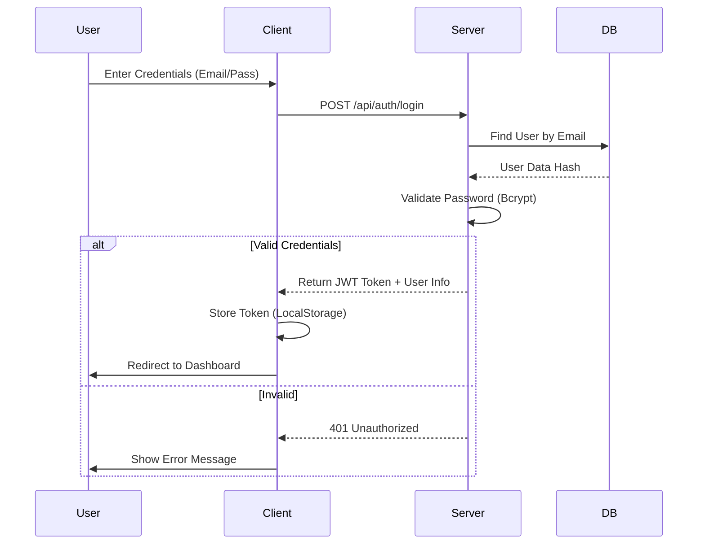
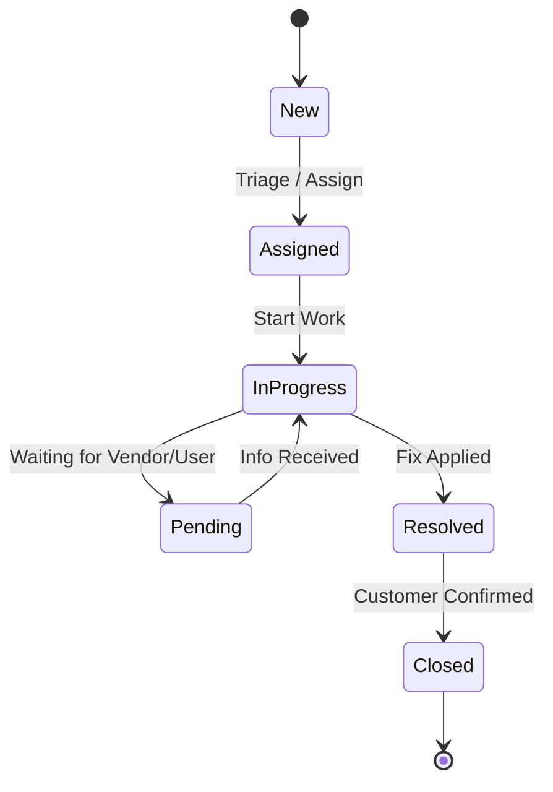

# LinkedEye-FinSpot Project Plan & Architecture

## 1. Project Overview
**LinkedEye-FinSpot** is an enterprise-grade IT Service Management (ITSM) and Network Monitoring platform. It allows organizations to manage Incidents, Changes, Problems, Assets, and Network Topology in real-time.

### Key Features
- **Dashboard**: Real-time stats, system health, and activity timelines.
- **Incident Management**: Tracking, filtering, and resolving IT incidents.
- **Change Management**: CAB workflows and approval chains.
- **Network Topology**: Visualizing infrastructure.
- **Auto-Remediation**: Integration with automation tools.

## 2. Technology Stack

### Frontend (Client)
- **Framework**: React (Vite) for a fast, modern SPA experience.
- **Styling**: Standard CSS (Modular approach) to match the existing premium design precisely using CSS Variables.
- **Charting**: Chart.js (reusing the existing library choice).
- **Icons**: FontAwesome.

### Backend (Server)
- **Runtime**: Node.js.
- **Framework**: Express.js for REST API.
- **Database**: PostgreSQL (Relational data fits ITSM perfectly).
- **ORM**: Prisma (for type-safe database access).
- **Authentication**: JWT (JSON Web Tokens).

## 3. Project Structure

```
linkedeye-finspot/
├── client/                 # Frontend Application
│   ├── public/
│   ├── src/
│   │   ├── assets/         # Images, global css
│   │   ├── components/     # Reusable UI components (Sidebar, Topbar, KPI Cards)
│   │   ├── contexts/       # Auth Context, Theme Context
│   │   ├── layouts/        # DashboardLayout, AuthLayout
│   │   ├── pages/          # Dashboard, Login, IncidentList, IncidentDetail
│   │   ├── services/       # API integration
│   │   └── main.jsx
│   ├── index.html
│   └── vite.config.js
│
├── server/                 # Backend Application
│   ├── src/
│   │   ├── config/         # DB config, environment vars
│   │   ├── controllers/    # Request handlers
│   │   ├── middleware/     # Auth middleware, Error handling
│   │   ├── routes/         # API routes
│   │   ├── utils/          # Helper functions
│   │   └── app.js          # App entry point
│   ├── prisma/             # Database schema
│   │   └── schema.prisma
│   └── package.json
│
└── README.md
```

## 4. Application Flow & Diagrams

### Authentication Flow


### Incident Management Lifecycle


## 5. Database Schema (Draft)

### Users
- `id` (UUID)
- `email` (String, Unique)
- `password_hash` (String)
- `full_name` (String)
- `role` (Enum: ADMIN, AGENT, READ_ONLY)
- `department` (String)

### Incidents
- `id` (String - custom format INC-001)
- `title` (String)
- `description` (Text)
- `priority` (Enum: CRITICAL, HIGH, MEDIUM, LOW)
- `status` (Enum: NEW, ASSIGNED, IN_PROGRESS, RESOLVED, CLOSED)
- `reporter_id` (FK -> User)
- `assignee_id` (FK -> User)
- `created_at` (DateTime)
- `updated_at` (DateTime)

### Assets (Configuration Items)
- `id` (UUID)
- `name` (String)
- `type` (Server, Database, Switch)
- `ip_address` (String)
- `status` (ONLINE, OFFLINE, MAINTENANCE)

## 6. Implementation Steps
1.  **Setup Backend**: Initialize Node/Express, set up Prisma with SQLite (for dev) or Postgres.
2.  **Setup Frontend**: Initialize Vite React project.
3.  **Port Styles**: Copy CSS variables and global styles to `client/src/index.css`.
4.  **Components**: Build Sidebar, Layout, and basic reusable UI.
5.  **Pages**: Implement Login and Dashboard using the existing HTML reference.
6.  **Integration**: Connect Login and Dashboard to the live API.

